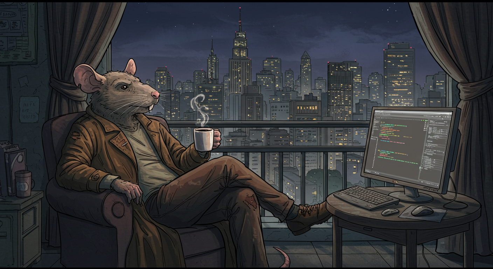

  

  <h1 style="color:#ffe4e1; letter-spacing: 2px; text-transform: uppercase;">Leonardo Magdanello Araujo</h1>
  <h3 style="color:#aaaaaa; font-weight:normal;">Senior DevOps Engineer & HPC Specialist</h3>

  
  
  
  

  

  <h3>🕵️ About Me</h3>

  

    DevOps Engineer and HPC Specialist with 7+ years in international companies. Full-stack expertise spanning low-level hardware to cloud-native solutions. Proficient in Python and Go development, systems architecture, and delivering scalable solutions across multicultural teams.
  

  <h4>💼 Currently at <a href=https://eviden.com/>Eviden</a></h4>

  <ul style="text-align: left; max-width: 800px; margin: auto;">
    
R&D developer for Smart Management Center (SMC), which provides a solution for deploying, updating, maintaining and managing software of HPC systems of up to 1,200 nodes with very low technical requirements on daily administration tasks

    
Core contributor to BlueBanquise open-source project

  </ul>

  
<strong>Tools I chew on a daily basis:</strong> <code>Ansible</code>, <code>Python</code>, <code>Go</code>, <code>Docker</code>, <code>Linux</code>, <code>Jenkins</code>, <code>Git</code>, <code>Podman</code>

  

  <h3>📊 GitHub Stats</h3>

  

    
    
  

  <h3>⚙️ Languages & Tools</h3>

  

    
    
    
    
    
    
    
  

  

  

    
🎧 Vibe while coding:

    
  

---

  

    🐀 Mice to Meet you.
  

